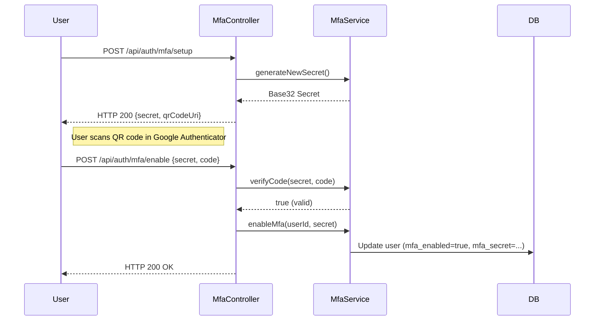
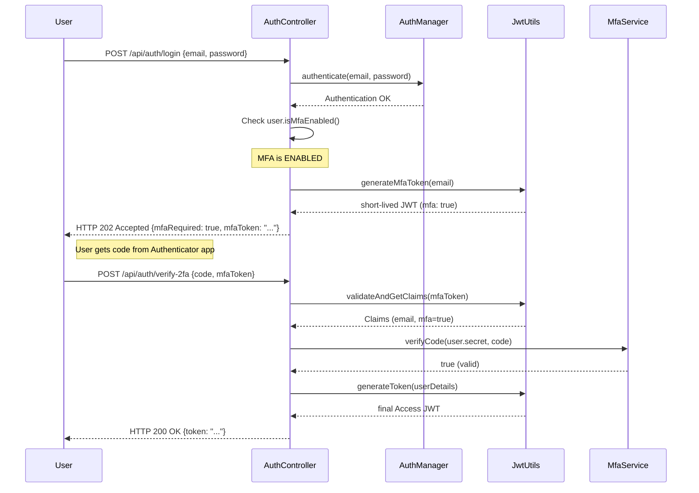
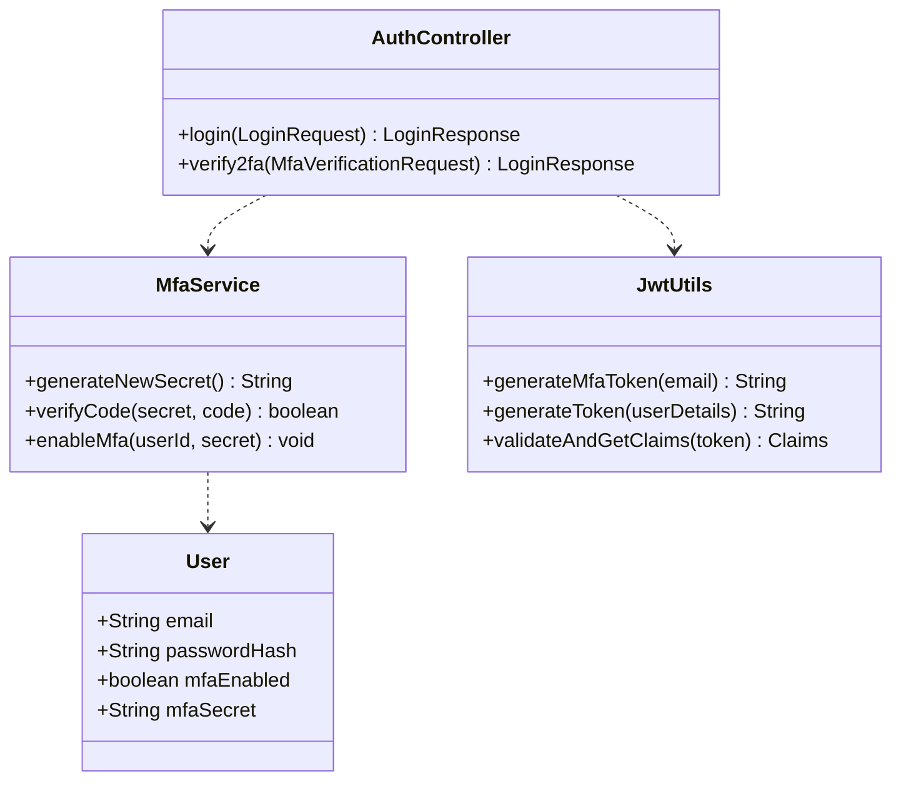

# Multi-Factor Authentication (TOTP) Flow

## 1. MFA Setup Flow (Registration of 2FA)

This flow occurs when a logged-in user decides to enable 2FA.

## 2. Two-Step Login Flow

This flow occurs during login if MFA is enabled for the user.

## 3. Data Model

## Key Security Features
1. **Intermediate Token**: The `mfaToken` is not a valid access token. It only grants access to the `/verify-2fa` endpoint.
2. **Short TTL**: `mfaToken` expires in 5 minutes.
3. **MFA Verification**: MFA is only enabled after the user provides a valid code for the secret (prevents lockout).
