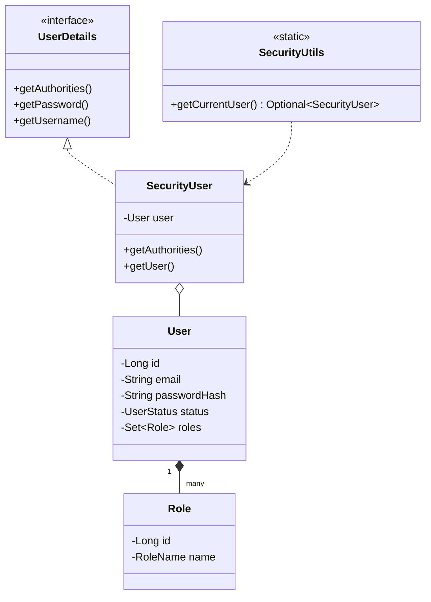

# UML Diagrams

## User & Security Pattern



## Security Flow

```text
HTTP Request
    ↓
SecurityFilterChain
    ↓
BasicAuthenticationFilter
    ↓
AuthenticationManager
    ↓
CustomUserDetailsService  ───>  UserRepository (PostgreSQL)
    ↓
SecurityUser (Principal)
    ↓
Controller  <───  SecurityUtils
```
