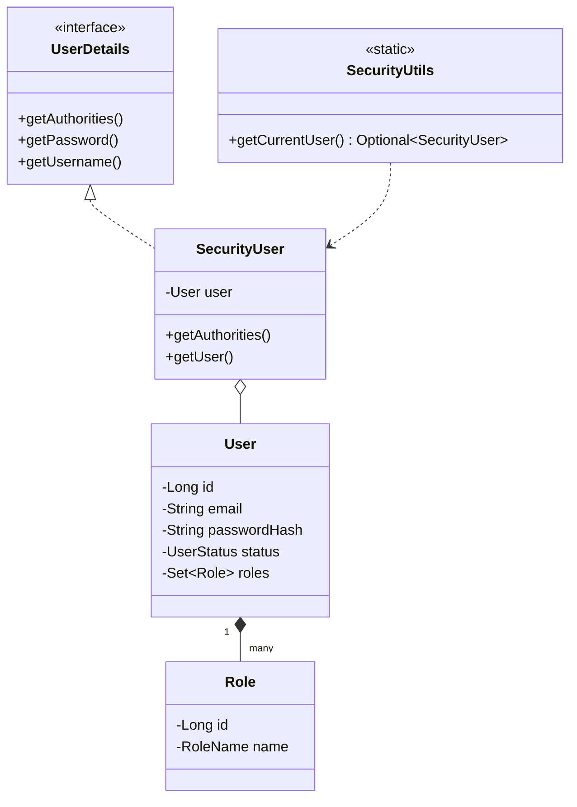
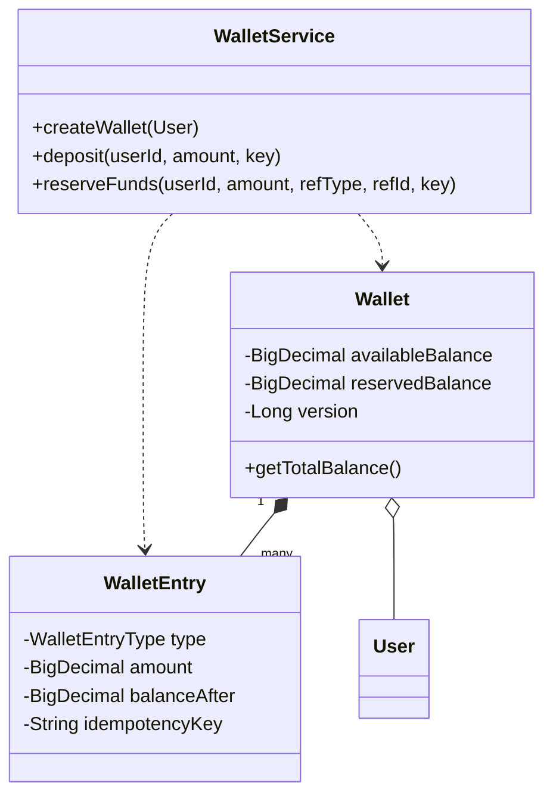

# UML Diagrams

## User & Security Pattern

```mermaid
classDiagram
    class UserDetails {
        <<interface>>
        +getAuthorities()
        +getPassword()
        +getUsername()
    }

    class SecurityUser {
        -User user
        +getAuthorities()
        +getUser()
    }

    class SecurityUtils {
        <<static>>
        +getCurrentUser() Optional~SecurityUser~
    }

    class User {
        -Long id
        -String email
        -String passwordHash
        -UserStatus status
        -Set~Role~ roles
    }

    class Role {
        -Long id
        -RoleName name
    }

    UserDetails <|.. SecurityUser
    SecurityUser o-- User
    User "1" *-- "many" Role
    SecurityUtils ..> SecurityUser
```

## Wallet & Ledger Pattern

```mermaid
classDiagram
    class Wallet {
        -BigDecimal availableBalance
        -BigDecimal reservedBalance
        -Long version
        +getTotalBalance()
    }

    class WalletEntry {
        -WalletEntryType type
        -BigDecimal amount
        -BigDecimal balanceAfter
        -String idempotencyKey
    }

    class WalletService {
        +createWallet(User)
        +deposit(userId, amount, key)
        +reserveFunds(userId, amount, refType, refId, key)
    }

    Wallet "1" *-- "many" WalletEntry
    Wallet o-- User
    WalletService ..> Wallet
    WalletService ..> WalletEntry
```
